# YAMLGraph Architecture

> Single source of truth for YAMLGraph architecture, capabilities, and requirements traceability.

## Design Philosophy

### Why YAML-First?

1. **Separation of concerns**: Pipeline logic in YAML, business logic in prompts
2. **No Python required**: Non-developers can create/modify pipelines
3. **Version control friendly**: Diff-able, reviewable configuration
4. **Runtime safety**: Schema validation catches errors before execution

### Why Dynamic State?

Traditional approach requires manual state class definitions:
```python
class MyState(TypedDict):
    topic: str
    generated: str  # Must manually add for each node
```

YAMLGraph generates state automatically from graph config:
```yaml
nodes:
  generate:
    state_key: generated  # ← Auto-added to state
```

**Tradeoffs:**
- ✅ Less boilerplate, faster iteration
- ✅ State always matches graph definition
- ❌ No static type checking in IDE
- ❌ Runtime errors instead of compile-time

### Application Layer Pattern

When building applications with YAMLGraph, use a three-layer architecture:

```
┌─────────────────────────────────────┐
│  Python CLI (demo.py, run_*.py)     │ ← Presentation: colors, REPL, args
├─────────────────────────────────────┤
│  YAML Graphs (*.yaml)               │ ← Logic: LLM, state, checkpoints
├─────────────────────────────────────┤
│  Python Tools (nodes/*.py)          │ ← Side effects: API calls, files
└─────────────────────────────────────┘
```

**Presentation Layer** (Python CLI):
- Argument parsing, terminal colors, interactive prompts
- Thin wrapper around graph execution
- Calls `app.invoke()` and formats output

**Logic Layer** (YAML Graphs):
- All LLM calls, routing, state transitions
- Interrupt nodes for human-in-the-loop
- Map nodes for parallel processing
- Checkpointing and resume capability

**Side Effects Layer** (Python Tools):
- External API calls (Replicate, databases)
- File I/O (image generation, exports)
- Functions that can't be expressed in YAML

**Why this pattern?**
- Graphs are testable, traceable, and resumable
- Python handles UX where YAML can't (colors, stdin)
- Tools isolate non-deterministic operations
- Each layer can evolve independently

### Building APIs on YAMLGraph

The same pattern extends to web APIs:

```
┌─────────────────────────────────────┐
│  FastAPI / Flask                    │ ← HTTP: routes, auth, validation
├─────────────────────────────────────┤
│  YAML Graphs                        │ ← Logic: stateless or with threads
├─────────────────────────────────────┤
│  Python Tools + Storage             │ ← Persistence: DB, S3, queues
└─────────────────────────────────────┘
```

**Key integration points:**

```python
from yamlgraph.graph_loader import compile_graph, load_graph_config

# One-shot execution (stateless)
@app.post("/generate")
def generate(request: GenerateRequest):
    config = load_graph_config("graphs/generate.yaml")
    graph = compile_graph(config).compile()
    result = graph.invoke({"topic": request.topic})
    return {"result": result}

# Multi-turn with threads (stateful)
@app.post("/chat/{thread_id}")
def chat(thread_id: str, message: ChatMessage):
    config = load_graph_config("graphs/chat.yaml")
    checkpointer = get_checkpointer_for_graph(config)
    graph = compile_graph(config).compile(checkpointer=checkpointer)

    run_config = {"configurable": {"thread_id": thread_id}}
    result = graph.invoke(Command(resume=message.content), run_config)
    return {"response": result}
```

See [docs/plan-api-yamlgraph.md](docs/plan-api-yamlgraph.md) for detailed API design patterns.

### Production Example: NPC Encounter

The **examples/npc** directory demonstrates a full production pattern:

```
┌─────────────────────────────────────────────────────────────────┐
│  HTMX Frontend                                                  │
│  • HTML fragments, SSE streaming, minimal JS                    │
├─────────────────────────────────────────────────────────────────┤
│  FastAPI + Session Adapter                                      │
│  • EncounterSession wraps graph with thread_id management       │
│  • Human-in-loop via Command(resume=player_choice)              │
├─────────────────────────────────────────────────────────────────┤
│  YAMLGraph (encounter-multi.yaml)                               │
│  • Map nodes for parallel NPC generation                        │
│  • interrupt_before for player choice points                    │
├─────────────────────────────────────────────────────────────────┤
│  Prompts + Tools                                                │
│  • YAML prompts with Pydantic schemas                           │
│  • Tool functions for game mechanics                            │
└─────────────────────────────────────────────────────────────────┘
```

Key patterns demonstrated:
- **Session Adapter**: `EncounterSession` provides clean API over raw graph
- **Human-in-Loop**: `interrupt_before` + `Command(resume=...)` for player agency
- **Map Nodes**: Parallel fan-out with `Send()` for multi-NPC processing
- **HTMX Integration**: Server-rendered HTML fragments, no client framework

See [examples/npc/architecture.md](examples/npc/architecture.md) for full documentation.

---

## Module Architecture

```
┌─────────────────────────────────────────────────────────────────────────┐
│                           Entry Points                                   │
│  ┌─────────────┐  ┌─────────────┐  ┌─────────────┐                      │
│  │ cli/        │  │ builder.py  │  │ Python API  │                      │
│  │ (commands)  │  │ (high-level)│  │ (direct)    │                      │
│  └──────┬──────┘  └──────┬──────┘  └──────┬──────┘                      │
└─────────┼────────────────┼────────────────┼─────────────────────────────┘
          │                │                │
          ▼                ▼                ▼
┌─────────────────────────────────────────────────────────────────────────┐
│                         graph_loader.py                                  │
│  • load_graph_config() - Parse YAML → GraphConfig                       │
│  • compile_graph() - GraphConfig → StateGraph                           │
│  • _compile_edges() - Build edge connections                            │
└──────────────────────────────┬──────────────────────────────────────────┘
                               │
          ┌────────────────────┼────────────────────┐
          ▼                    ▼                    ▼
┌─────────────────┐  ┌─────────────────┐  ┌─────────────────┐
│ node_compiler.py│  │ map_compiler.py │  │ tools/agent.py  │
│ • compile_node()│  │ • Fan-out nodes │  │ • ReAct agents  │
│ • compile_nodes │  │ • Send() API    │  │ • Tool binding  │
│                 │  │ • Collection    │  │ • Max iterations│
└────────┬────────┘  └─────────────────┘  └─────────────────┘
         │
         ▼
┌─────────────────────────────────────────────────────────────┐
│                    node_factory/ (subpackage)                │
│  • llm_nodes.py - LLM and router nodes                      │
│  • control_nodes.py - Interrupt, passthrough                │
│  • subgraph_nodes.py - Nested graph composition             │
│  • tool_nodes.py - Tool call nodes                          │
│  • streaming.py - Token streaming support                   │
│  • base.py - Shared utilities                               │
└─────────────────────────────────────────────────────────────┘
         │
         ▼
┌─────────────────────────────────────────────────────────────────────────┐
│                          executor.py                                     │
│  • execute_prompt() - Load YAML prompt, call LLM, parse output          │
│  • format_prompt() - Variable substitution (simple or Jinja2)           │
│  • Schema resolution from YAML or Pydantic                              │
├──────────────────────────────────────────────────────────────────────────┤
│                        executor_async.py                                 │
│  • execute_prompt_async() - Async LLM calls                             │
│  • execute_prompt_streaming() - Token-by-token streaming                │
│  • run_graph_streaming() - Graph-level streaming (FR-023)               │
│  • load_and_compile_async() - Async graph compilation                   │
└──────────────────────────────┬──────────────────────────────────────────┘
                               │
          ┌────────────────────┼────────────────────┐
          ▼                    ▼                    ▼
┌─────────────────┐  ┌─────────────────┐  ┌─────────────────┐
│ llm_factory.py  │  │ schema_loader.py│  │ utils/prompts.py│
│ • Multi-provider│  │ • YAML → Pydantic│ │ • load_prompt() │
│ • 7 providers:  │  │ • JSON Schema   │  │ • resolve_path()│
│   Anthropic,    │  └─────────────────┘  └─────────────────┘
│   Google/Gemini,│
│   Mistral,      │
│   OpenAI,       │
│   Replicate,    │
│   xAI, LMStudio │
│ • Caching       │
└─────────────────┘
```

### Sync/Async Design Pattern

The codebase uses a **sync-first with async wrappers** pattern:

| Sync Module | Async Module | Relationship |
|-------------|--------------|--------------|
| `executor.py` | `executor_async.py` | Both use `executor_base.py` for shared logic |
| `llm_factory.py` | `llm_factory_async.py` | Async wraps sync via `run_in_executor` |

**Why this pattern?**
- **No duplication**: Async modules import from sync, adding only async-specific logic
- **Clean sync API**: Users not needing async get a simple, direct API
- **Async-specific features**: Streaming (`async for`), concurrent execution (`asyncio.gather`)
- **LangChain reality**: Underlying LLM clients are sync; async wrapping is appropriate

This is the idiomatic Python approach. An "async-first with `asyncio.run()` sync wrappers"
would add complexity and introduce event loop issues for sync users.

---

## End-to-End Flow

1. CLI loads YAML and validates structure.
2. Graph config is parsed and validated, with optional data file loading.
3. Dynamic state is generated from config.
4. Nodes are compiled into a LangGraph `StateGraph`.
5. Edges and routing are wired, including map and conditional edges.
6. The graph executes with prompt execution, tools, and error handling.
7. Optional persistence and export capture results and state.

Key flow anchors in code:
- Config load and loop defaults: [graph_loader.py](yamlgraph/graph_loader.py#L31) → [graph_loader.py](yamlgraph/graph_loader.py#L96) → [graph_loader.py](yamlgraph/graph_loader.py#L170)
- Compile and wire graph: [graph_loader.py](yamlgraph/graph_loader.py#L339)
- State generation: [state_builder.py](yamlgraph/models/state_builder.py#L127)
- Node compilation: [node_compiler.py](yamlgraph/node_compiler.py#L32) → [node_compiler.py](yamlgraph/node_compiler.py#L148)
- Prompt execution: [executor.py](yamlgraph/executor.py#L32) → [executor_base.py](yamlgraph/executor_base.py#L84)

---

## Capabilities & Requirements Traceability

YAMLGraph implements **12 capabilities** covering **46 requirements**. Each capability maps to specific modules.

### Capability Summary

| # | Capability | Primary Modules | Requirements |
|---|-----------|----------------|--------------|
| 1 | Configuration Loading & Validation | `graph_loader`, `models/graph_schema`, `utils/validators`, `linter/`, `data_loader` | REQ-YG-001 – 004 |
| 2 | Graph Compilation | `graph_loader`, `node_compiler` | REQ-YG-005 – 008 |
| 3 | Node Execution | `node_factory/llm_nodes`, `node_factory/streaming`, `utils/llm_factory`, `utils/llm_factory_async` | REQ-YG-009 – 011 |
| 4 | Prompt Execution | `executor`, `executor_base`, `executor_async`, `utils/prompts`, `utils/template`, `utils/json_extract` | REQ-YG-012 – 016 |
| 5 | Tool & Agent Integration | `node_factory/tool_nodes`, `tools/agent`, `tools/shell`, `tools/python_tool` | REQ-YG-017 – 020 |
| 6 | Routing & Flow Control | `node_factory/control_nodes`, `routing`, `utils/conditions` | REQ-YG-021 – 023 |
| 7 | State Persistence & Management | `models/state_builder`, `storage/checkpointer_factory`, `storage/simple_redis`, `storage/checkpointer` | REQ-YG-024 – 026 |
| 8 | Error Handling & Reliability | `error_handlers`, `models/schemas`, `executor_base` | REQ-YG-027 – 031 |
| 9 | CLI Interface | `cli/__init__`, `cli/graph_commands`, `cli/graph_validate`, `cli/deprecation`, `cli/helpers`, `cli/schema_commands` | REQ-YG-032 – 035 |
| 10 | Export & Serialization | `cli/schema_commands`, `cli/graph_commands`, `storage/export`, `storage/serializers` | REQ-YG-036 – 039 |
| 11 | Subgraph & Map Processing | `map_compiler`, `node_factory/subgraph_nodes` | REQ-YG-040 – 042 |
| 12 | Utilities & Infrastructure | `config`, `constants`, `schema_loader`, `node_factory/base`, `utils/logging`, `utils/parsing`, `utils/sanitize`, `utils/expressions` | REQ-YG-043 – 046 |
| 13 | LangSmith Tracing | `utils/tracing`, `cli/graph_commands` | REQ-YG-047 |
| 14 | Graph-Level Streaming | `executor_async`, `node_factory/streaming` | REQ-YG-048 – 049 |
| 15 | Expression Language | `utils/expressions`, `utils/conditions`, `utils/parsing` | REQ-YG-051 |

### 1. Configuration Loading & Validation

Load YAML graph configs, validate schemas, build state models, and ensure graph integrity through linting.

| Requirement | Description | Key Modules |
|------------|-------------|-------------|
| REQ-YG-001 | Load graph configurations from YAML files | `graph_loader.load_graph_config`, `cli/helpers`, `data_loader` |
| REQ-YG-002 | Validate graph configuration schemas and structures | `models/graph_schema`, `utils/validators` |
| REQ-YG-003 | Perform linting and pattern validation | `linter/graph_linter`, `linter/checks`, `linter/patterns/*` |
| REQ-YG-004 | Handle errors during configuration loading | `cli/helpers.GraphLoadError`, `data_loader.DataFileError` |

### 2. Graph Compilation

Transform validated configs into executable StateGraphs with node compilation, edge wiring, and loop detection.

| Requirement | Description | Key Modules |
|------------|-------------|-------------|
| REQ-YG-005 | Load YAML graph definitions into StateGraphs | `graph_loader`, `graph_loader.load_and_compile` |
| REQ-YG-006 | Validate graph structures (cycle detection, loop defaults) | `graph_loader.detect_loop_nodes`, `graph_loader.apply_loop_node_defaults` |
| REQ-YG-007 | Compile individual nodes | `node_compiler.compile_node`, `node_factory` |
| REQ-YG-008 | Compile full graph configuration | `graph_loader.compile_graph`, `node_compiler.compile_nodes` |

### 3. Node Execution

Create executable node functions for LLM, streaming, tool, interrupt, and subgraph behavior.

| Requirement | Description | Key Modules |
|------------|-------------|-------------|
| REQ-YG-009 | Node creation and streaming | `node_factory/llm_nodes`, `node_factory/streaming` |
| REQ-YG-010 | Synchronous LLM factory management | `utils/llm_factory` |
| REQ-YG-011 | Asynchronous LLM factory management | `utils/llm_factory_async` |

### 4. Prompt Execution

Load prompt YAML, validate variables, format messages, and run LLM calls sync and async.

| Requirement | Description | Key Modules |
|------------|-------------|-------------|
| REQ-YG-012 | Prompt loading and resolution | `utils/prompts` |
| REQ-YG-013 | Variable resolution and template management | `executor_base.format_prompt`, `utils/expressions`, `utils/template` |
| REQ-YG-014 | Synchronous prompt execution | `executor.PromptExecutor`, `executor.execute_prompt` |
| REQ-YG-015 | Asynchronous prompt execution | `executor_async` |
| REQ-YG-016 | JSON extraction from LLM outputs | `utils/json_extract` |

### 5. Tool & Agent Integration

Integrate shell and Python tools into graphs, enable agent loops for tool-calling.

| Requirement | Description | Key Modules |
|------------|-------------|-------------|
| REQ-YG-017 | Dynamic tool node creation | `node_factory/tool_nodes` |
| REQ-YG-018 | Agent-driven tool selection and execution | `tools/agent` |
| REQ-YG-019 | Shell tool integration and execution | `tools/shell`, `tools/nodes` |
| REQ-YG-020 | Python tool integration and execution | `tools/python_tool` |

### 6. Routing & Flow Control

Route across nodes using explicit routes, expression evaluation, and control nodes.

| Requirement | Description | Key Modules |
|------------|-------------|-------------|
| REQ-YG-021 | Control node creation (interrupt, passthrough) | `node_factory/control_nodes` |
| REQ-YG-022 | Conditional routing functions | `routing` |
| REQ-YG-023 | Condition expression evaluation | `utils/conditions` |

### 7. State Persistence & Management

Checkpointers and Redis storage for resuming pipelines and state history.

| Requirement | Description | Key Modules |
|------------|-------------|-------------|
| REQ-YG-024 | Dynamic state class generation | `models/state_builder` |
| REQ-YG-025 | Checkpointer provisioning | `storage/checkpointer_factory` |
| REQ-YG-026 | State persistence operations (Redis) | `storage/simple_redis`, `storage/checkpointer` |

### 8. Error Handling & Reliability

Error strategies (retry, fallback, skip), sanitization, resilience features.

| Requirement | Description | Key Modules |
|------------|-------------|-------------|
| REQ-YG-027 | Error handling strategies (skip, fail, retry, fallback) | `error_handlers` |
| REQ-YG-028 | Pre-execution validation (requirements, loop limits) | `error_handlers.check_requirements`, `error_handlers.check_loop_limit` |
| REQ-YG-029 | Error state management (NodeResult, skip updates) | `error_handlers.NodeResult`, `error_handlers.build_skip_error_state` |
| REQ-YG-030 | Error schemas and reporting | `models/schemas.PipelineError`, `models/schemas.ErrorType` |
| REQ-YG-031 | Retry capability | `executor_base.is_retryable`, `executor._invoke_with_retry` |

### 9. CLI Interface

Command-line commands for graph validation, execution, info display, schema export.

| Requirement | Description | Key Modules |
|------------|-------------|-------------|
| REQ-YG-032 | CLI entry point and parser setup | `cli/__init__`, `cli/__main__` |
| REQ-YG-033 | Graph command execution and information | `cli/graph_commands` |
| REQ-YG-034 | Deprecation handling for CLI commands | `cli/deprecation` |
| REQ-YG-035 | CLI utilities and schema command dispatch | `cli/helpers`, `cli/schema_commands` |

### 10. Export & Serialization

Export results/states in JSON/Markdown, handle serialization for persistence.

| Requirement | Description | Key Modules |
|------------|-------------|-------------|
| REQ-YG-036 | CLI schema export and access | `cli/schema_commands` |
| REQ-YG-037 | Graph code generation for IDE support | `cli/graph_commands.cmd_graph_codegen` |
| REQ-YG-038 | Export and management of pipeline results/states | `storage/export` |
| REQ-YG-039 | Serialization and deserialization utilities | `storage/serializers` |

### 11. Subgraph & Map Processing

Parallel fan-out and nested subgraph execution.

| Requirement | Description | Key Modules |
|------------|-------------|-------------|
| REQ-YG-040 | Map node compilation | `map_compiler` |
| REQ-YG-041 | Output wrapping for reduction | `map_compiler.wrap_for_reducer` |
| REQ-YG-042 | Subgraph node creation | `node_factory/subgraph_nodes` |

### 12. Utilities & Infrastructure

Logging, templating, JSON extraction, environment handling, and shared utilities.

| Requirement | Description | Key Modules |
|------------|-------------|-------------|
| REQ-YG-043 | Configuration and constants management | `config`, `constants` |
| REQ-YG-044 | Schema loading and model building | `schema_loader` |
| REQ-YG-045 | Node factory and resolution | `node_factory/base` |
| REQ-YG-046 | Logging, parsing, and sanitization utilities | `utils/logging`, `utils/parsing`, `utils/sanitize` |
| REQ-YG-047 | LangSmith trace URL retrieval and sharing | `utils/tracing`, `cli/graph_commands` |

### 13. LangSmith Tracing

Observability via LangSmith: trace URL retrieval, public sharing, and tracer injection.

| Requirement | Description | Key Modules |
|------------|-------------|-------------|
| REQ-YG-047 | LangSmith trace URL retrieval and sharing | `utils/tracing`, `cli/graph_commands` |

### 14. Graph-Level Streaming

Stream LLM tokens through the compiled graph pipeline using LangGraph's `astream(stream_mode="messages")`, enabling real-time SSE output.

| Requirement | Description | Key Modules |
|------------|-------------|-------------|
| REQ-YG-048 | Graph-level streaming: run graph with `astream(stream_mode="messages")` yielding LLM tokens | `executor_async` |
| REQ-YG-049 | SSE streaming endpoint: format graph-streamed tokens as OpenAI-compatible SSE chunks | `executor_async`, `node_factory/streaming` |
| REQ-YG-050 | Per-node and default-level `model` override: graph YAML `model` field flows through `execute_prompt()` to `create_llm()` | `node_factory/llm_nodes`, `executor`, `executor_async`, `executor_base` |
| REQ-YG-051 | Expression language: value expressions (`{state.path}`, arithmetic, list/dict ops), condition expressions (comparisons, compound AND/OR), literal parsing, `resolve_node_variables` batch resolution | `utils/expressions`, `utils/conditions`, `utils/parsing` |

---

## Key Data Flows

### 1. Graph Compilation

```
YAML file → load_graph_config() → GraphConfig
                                      │
                    ┌─────────────────┼─────────────────┐
                    ▼                 ▼                 ▼
            build_state_class()  parse_tools()   compile_graph()
                    │                 │                 │
                    ▼                 ▼                 ▼
            Dynamic TypedDict   Tool Registry    StateGraph
                                                       │
                                              graph.compile()
                                                       │
                                                       ▼
                                              CompiledGraph
```

### 2. Node Execution

```
CompiledGraph.invoke(state)
         │
         ▼
    Node Function (from node_factory)
         │
         ├──→ check_requirements() - Verify required state keys
         │
         ├──→ check_loop_limit() - Prevent infinite loops
         │
         ├──→ skip_if_exists check - Resume support
         │
         ▼
    execute_prompt(prompt_name, variables, schema)
         │
         ├──→ load_prompt() - Load YAML prompt file
         │
         ├──→ format_prompt() - Substitute variables
         │
         ├──→ create_llm() - Get LLM instance
         │
         └──→ llm.with_structured_output() - Parse to Pydantic
                    │
                    ▼
              Return {state_key: result}
```

### 3. Error Handling

```
Node execution raises Exception
         │
         ▼
    on_error setting?
         │
    ┌────┼────┬────────┬──────────┐
    ▼    ▼    ▼        ▼          ▼
  skip  fail  retry  fallback  default
    │    │      │       │          │
    │    │      │       │          ▼
    │    │      │       │    PipelineError
    │    │      │       │    to state.errors
    │    │      │       │
    │    │      │       ▼
    │    │      │   Try alternate provider
    │    │      │
    │    │      ▼
    │    │   Loop up to max_retries
    │    │
    │    ▼
    │   Raise immediately
    │
    ▼
  Log warning, return {}
```

### 4. Pipeline Flow

```mermaid
graph TD
    A["📝 generate"] -->|content| B{should_continue}
    B -->|"✓ content exists"| C["🔍 analyze"]
    B -->|"✗ error/empty"| F["🛑 END"]
    C -->|analysis| D["📊 summarize"]
    D -->|final_summary| F

    style A fill:#e1f5fe
    style C fill:#fff3e0
    style D fill:#e8f5e9
    style F fill:#fce4ec
```



**Node Outputs:**

| Node | Output Type | Description |
|------|-------------|-------------|
| `generate` | Inline schema | Title, content, word_count, tags |
| `analyze` | Inline schema | Summary, key_points, sentiment, confidence |
| `summarize` | `str` | Final combined summary |

Output schemas are defined inline in YAML prompt files using the `schema:` block.

### 5. Resume Flow

Pipelines can be resumed from any checkpoint. The resume behavior uses `skip_if_exists`:
nodes check if their output already exists in state and skip LLM calls if so.


```bash
# Resume an interrupted run (using checkpointer)
yamlgraph graph run graphs/my-graph.yaml --thread abc123
```

When resumed:
- Nodes with existing outputs are **skipped** (no duplicate LLM calls)
- Only nodes without outputs in state actually run
- State is preserved via SQLite checkpointing

---

## Extension Points

### Tutorial: Adding a New Node (YAML-First Approach)

Let's add a "fact_check" node that verifies generated content.

**Step 1: Create the prompt** (`prompts/fact_check.yaml`):
```yaml
system: |
  You are a fact-checker. Analyze the given content and identify
  claims that can be verified. Assess the overall verifiability.

user: |
  Content to fact-check:
  {content}

  Identify key claims and assess their verifiability.
```

**Step 2: Add the node to your graph** (`graphs/yamlgraph.yaml`):
```yaml
nodes:
  generate:
    type: llm
    prompt: generate
    output_schema:  # Inline schema - no Python model needed!
      title: str
      content: str
    state_key: generated

  fact_check:  # ✨ New node - just YAML!
    type: llm
    prompt: fact_check
    output_schema:  # Define schema inline
      is_accurate: bool
      issues: list[str]
    requires: [generated]
    variables:
      content: generated.content
    state_key: fact_check

edges:
  - from: START
    to: generate
  - from: generate
    to: fact_check
  - from: fact_check
    to: END
```

That's it! No Python node code needed. The graph loader dynamically generates the node function.

**Step 3 (optional): Define reusable schema** (`yamlgraph/models/schemas.py`):
```python
class FactCheck(BaseModel):
    """Structured fact-checking output."""
    claims: list[str] = Field(description="Claims identified in content")
    verified: bool = Field(description="Whether claims are verifiable")
    confidence: float = Field(ge=0.0, le=1.0, description="Verification confidence")
```

### Tutorial: Adding Conditional Branching

Route to different nodes based on analysis results (all in YAML):

```yaml
edges:
  - from: analyze
    to: rewrite_node
    condition:
      type: field_equals
      field: analysis.sentiment
      value: negative

  - from: analyze
    to: enhance_node
    condition:
      type: field_equals
      field: analysis.sentiment
      value: positive

  - from: analyze
    to: summarize  # Default fallback
```

### Adding a New Node Type

1. **Add to constants.py**:
   ```python
   class NodeType(StrEnum):
       MY_NODE = "my_node"
   ```

2. **Create factory function** in `node_factory.py`:
   ```python
   def create_my_node(node_name: str, node_config: dict) -> Callable:
       def node_fn(state: dict) -> dict:
           # Process state
           return {"result_key": result}
       return node_fn
   ```

3. **Register in node_compiler.py** `compile_node()`:
   ```python
   elif node_type == NodeType.MY_NODE:
       node_fn = create_my_node(node_name, node_config)
       graph.add_node(node_name, node_fn)
   ```

4. **Add tests** in `tests/unit/test_my_node.py`

5. **Document** in `reference/graph-yaml.md`

### Adding a New LLM Provider

1. **Add to config.py** `DEFAULT_MODELS`:
   ```python
   DEFAULT_MODELS = {
       "anthropic": os.getenv("ANTHROPIC_MODEL", "claude-haiku-4-5"),
       "my_provider": os.getenv("MY_PROVIDER_MODEL", "my-model"),
   }
   ```

2. **Update llm_factory.py**:
   ```python
   elif selected_provider == "my_provider":
       from langchain_my_provider import ChatMyProvider
       llm = ChatMyProvider(model=selected_model, temperature=temperature)
   ```

3. **Add to pyproject.toml** dependencies (optional extra)

4. **Update reference docs** (graph-yaml.md defaults section)

### Adding a New Tool Type

1. **Create parser** in `yamlgraph/tools/my_tool.py`:
   ```python
   def parse_my_tools(tools_config: dict) -> list[BaseTool]:
       """Parse tools with type: my_tool."""
       tools = []
       for name, config in tools_config.items():
           if config.get("type") == "my_tool":
               tools.append(create_my_tool(name, config))
       return tools
   ```

2. **Register in graph_loader.py**:
   ```python
   from yamlgraph.tools.my_tool import parse_my_tools

   # In compile_graph():
   all_tools.extend(parse_my_tools(config.tools))
   ```

3. **Add tests and docs**

---

## Testing Strategy

### Test Categories

| Category | Location | Purpose |
|----------|----------|---------|
| Unit | `tests/unit/` | Single module isolation |
| Integration | `tests/integration/` | Multi-module flows |

### Key Fixtures (conftest.py)

```python
@pytest.fixture
def mock_llm():
    """Mock LLM that returns predictable structured output."""

@pytest.fixture
def temp_graph_file(tmp_path):
    """Create temporary YAML graph files for testing."""

@pytest.fixture
def sample_state():
    """Common test state dictionary."""
```

### Testing Patterns

**1. Mock LLM for unit tests:**
```python
def test_node_execution(mock_llm, monkeypatch):
    monkeypatch.setattr("yamlgraph.executor.create_llm", lambda **k: mock_llm)
    result = execute_prompt("test", {})
    assert result is not None
```

**2. Real LLM for integration tests:**
```python
@pytest.mark.integration
@pytest.mark.skipif(not os.getenv("ANTHROPIC_API_KEY"), reason="No API key")
def test_full_pipeline():
    ...
```

**3. YAML fixture files:**
```python
def test_router(tmp_path):
    graph_yaml = tmp_path / "test.yaml"
    graph_yaml.write_text("""
version: "1.0"
nodes:
  classify:
    type: router
    ...
""")
    config = load_graph_config(graph_yaml)
```

### Requirement Traceability (ADR-001)

Every test function is linked to one or more requirements via `@pytest.mark.req`:

```python
@pytest.mark.req("REQ-YG-014", "REQ-YG-031")
def test_invoke_with_retry_succeeds_after_transient_failure(mock_llm):
    ...
```

#### `scripts/req-coverage.py`

Generates a traceability matrix from `@pytest.mark.req` markers using AST parsing.

| Command | Purpose |
|---------|---------|
| `python scripts/req-coverage.py` | Summary: per-capability coverage |
| `python scripts/req-coverage.py --detail` | Full mapping: every test → requirement |
| `python scripts/req-coverage.py --strict` | CI gate: exits non-zero if any REQ uncovered |

#### Current Coverage (v0.4.21)

```
Requirements: 47/47 covered | Tagged tests: 1341 unique, 1671 test-req pairs

 ✅  1. Config Loading & Validation:  4/4 reqs, 202 tests
 ✅  2. Graph Compilation:            4/4 reqs, 109 tests
 ✅  3. Node Execution:               3/3 reqs,  99 tests
 ✅  4. Prompt Execution:             5/5 reqs, 295 tests
 ✅  5. Tool & Agent Integration:     4/4 reqs,  90 tests
 ✅  6. Routing & Flow Control:       3/3 reqs, 109 tests
 ✅  7. State Persistence:            3/3 reqs, 191 tests
 ✅  8. Error Handling:               5/5 reqs,  82 tests
 ✅  9. CLI Interface:                4/4 reqs,  72 tests
 ✅ 10. Export & Serialization:       4/4 reqs, 169 tests
 ✅ 11. Subgraph & Map:              3/3 reqs,  88 tests
 ✅ 12. Utilities:                    4/4 reqs, 139 tests
 ✅ 13. LangSmith Tracing:           1/1 reqs,  26 tests
```

See `docs/adr/001-test-requirement-traceability.md` for decision rationale.

---

## Code Quality Rules

### Module Size Limits
- **Target**: < 400 lines
- **Maximum**: 500 lines
- **Action**: Split into submodules if exceeded

### Type Hints
- All public functions must have type hints
- Use `|` for unions (Python 3.11+)
- Use `TypedDict` for state dictionaries

### Logging
- Use `logging.getLogger(__name__)`
- User-facing prints use emojis: 📝 🔍 ✓ ✗ 🚀

### Error Handling
```python
from yamlgraph.models import PipelineError

try:
    result = risky_operation()
except Exception as e:
    error = PipelineError.from_exception(e, node="node_name")
    return {"errors": state.get("errors", []) + [error]}
```

---

## Key Design Decisions

### 1. No State Mutation
Nodes return dicts with state updates. Never mutate state directly:
```python
# ❌ Wrong
def node_fn(state):
    state["key"] = value
    return state

# ✅ Correct
def node_fn(state):
    return {"key": value}
```

### 2. YAML Prompts Only
All prompts live in `prompts/*.yaml`. Never hardcode prompts in Python:
```python
# ❌ Wrong
llm.invoke("Generate a summary of {topic}")

# ✅ Correct
execute_prompt("summarize", {"topic": topic})
```

### 3. Factory Pattern for LLMs
Use the factory, not direct imports:
```python
# ❌ Wrong
from langchain_anthropic import ChatAnthropic
llm = ChatAnthropic(model="claude-3")

# ✅ Correct
from yamlgraph.utils.llm_factory import create_llm
llm = create_llm(provider="anthropic")
```

### 4. Thread-Safe Caching
LLM instances and loading stacks use thread-local storage:
```python
_llm_cache: dict[tuple, BaseChatModel] = {}
_cache_lock = threading.Lock()

_loading_stack: ContextVar[list[Path]] = ContextVar("loading_stack")
```

---

## File Reference

| File | Purpose | Capabilities |
|------|---------|-------------|
| `graph_loader.py` | YAML → LangGraph compilation | 1, 2 |
| `node_compiler.py` | Node dispatch to factories | 2 |
| `node_factory/` | Node function creation (subpackage) | 3, 5, 6, 11 |
| `node_factory/llm_nodes.py` | LLM and router nodes | 3 |
| `node_factory/streaming.py` | Token streaming support | 3 |
| `node_factory/control_nodes.py` | Interrupt and passthrough nodes | 6 |
| `node_factory/tool_nodes.py` | Tool call nodes | 5 |
| `node_factory/subgraph_nodes.py` | Nested graph composition | 11 |
| `node_factory/base.py` | Shared utilities (resolve_class, output models) | 12 |
| `executor.py` | Sync prompt execution with retry | 4 |
| `executor_base.py` | Shared executor logic (format, messages, retry check) | 4, 8 |
| `executor_async.py` | Async prompt execution and streaming | 4, 14 |
| `map_compiler.py` | Parallel fan-out with Send() | 11 |
| `routing.py` | Edge condition evaluation | 6 |
| `error_handlers.py` | Error strategies (skip, fail, retry, fallback) | 8 |
| `data_loader.py` | Load external data files into state | 1 |
| `schema_loader.py` | YAML schema → Pydantic models | 12 |
| `tools/agent.py` | ReAct agent creation | 5 |
| `tools/shell.py` | Shell tool execution | 5 |
| `tools/python_tool.py` | Python tool integration | 5 |
| `tools/nodes.py` | Tool node creation | 5 |
| `utils/llm_factory.py` | Multi-provider LLM factory (7 providers) | 3 |
| `utils/llm_factory_async.py` | Async LLM factory | 3 |
| `utils/expressions.py` | Template and state path resolution | 4 |
| `utils/conditions.py` | Condition expression evaluation | 6 |
| `utils/prompts.py` | Prompt loading and path resolution | 4 |
| `utils/template.py` | Variable extraction and validation | 4 |
| `utils/json_extract.py` | JSON extraction from LLM text | 4 |
| `utils/validators.py` | Config validation functions | 1 |
| `utils/logging.py` | Structured logging | 12 |
| `utils/parsing.py` | Literal parsing utilities | 12 |
| `utils/sanitize.py` | Input sanitization | 12 |
| `models/state_builder.py` | Dynamic state class generation | 7 |
| `models/graph_schema.py` | Pydantic graph config schema | 1 |
| `models/schemas.py` | PipelineError, ErrorType, GenericReport | 8, 12 |
| `config.py` | Centralized paths and settings | 12 |
| `constants.py` | NodeType, ErrorHandler, EdgeType enums | 12 |
| `storage/checkpointer_factory.py` | Checkpointer provisioning | 7 |
| `storage/checkpointer.py` | State persistence operations | 7 |
| `storage/simple_redis.py` | Redis-based checkpointer | 7 |
| `storage/serializers.py` | Serialization/deserialization helpers | 10 |
| `storage/export.py` | Export results/state to JSON | 10 |
| `linter/graph_linter.py` | Graph linting entry point | 1 |
| `linter/checks.py` | Individual lint checks | 1 |
| `linter/patterns/` | Pattern validators (agent, interrupt, map, router, subgraph) | 1 |
| `cli/__init__.py` | CLI entry point and parser | 9 |
| `cli/graph_commands.py` | graph run, info, codegen | 9, 10 |
| `cli/graph_validate.py` | graph validate, lint | 9 |
| `cli/schema_commands.py` | schema export, path | 10 |
| `cli/helpers.py` | Shared CLI utilities | 9 |
| `cli/deprecation.py` | Deprecated command handling | 9 |

---

## Contributing

1. **Read this doc first** - Understand the architecture
2. **TDD approach** - Write tests before implementation
3. **Small PRs** - One feature per PR
4. **Update docs** - Reference docs and docstrings
5. **Run full test suite**: `pytest tests/ -q`
