# YAMLGraph Architecture

> Internal architecture guide for core developers and contributors.

## Design Philosophy

### Why YAML-First?

1. **Separation of concerns**: Pipeline logic in YAML, business logic in prompts
2. **No Python required**: Non-developers can create/modify pipelines
3. **Version control friendly**: Diff-able, reviewable configuration
4. **Runtime safety**: Schema validation catches errors before execution

### Why Dynamic State?

Traditional approach requires manual state class definitions:
```python
class MyState(TypedDict):
    topic: str
    generated: str  # Must manually add for each node
```

YAMLGraph generates state automatically from graph config:
```yaml
nodes:
  generate:
    state_key: generated  # ← Auto-added to state
```

**Tradeoffs:**
- ✅ Less boilerplate, faster iteration
- ✅ State always matches graph definition
- ❌ No static type checking in IDE
- ❌ Runtime errors instead of compile-time

### Application Layer Pattern

When building applications with YAMLGraph, use a three-layer architecture:

```
┌─────────────────────────────────────┐
│  Python CLI (demo.py, run_*.py)     │ ← Presentation: colors, REPL, args
├─────────────────────────────────────┤
│  YAML Graphs (*.yaml)               │ ← Logic: LLM, state, checkpoints
├─────────────────────────────────────┤
│  Python Tools (nodes/*.py)          │ ← Side effects: API calls, files
└─────────────────────────────────────┘
```

**Presentation Layer** (Python CLI):
- Argument parsing, terminal colors, interactive prompts
- Thin wrapper around graph execution
- Calls `app.invoke()` and formats output

**Logic Layer** (YAML Graphs):
- All LLM calls, routing, state transitions
- Interrupt nodes for human-in-the-loop
- Map nodes for parallel processing
- Checkpointing and resume capability

**Side Effects Layer** (Python Tools):
- External API calls (Replicate, databases)
- File I/O (image generation, exports)
- Functions that can't be expressed in YAML

**Why this pattern?**
- Graphs are testable, traceable, and resumable
- Python handles UX where YAML can't (colors, stdin)
- Tools isolate non-deterministic operations
- Each layer can evolve independently

### Building APIs on YAMLGraph

The same pattern extends to web APIs:

```
┌─────────────────────────────────────┐
│  FastAPI / Flask                    │ ← HTTP: routes, auth, validation
├─────────────────────────────────────┤
│  YAML Graphs                        │ ← Logic: stateless or with threads
├─────────────────────────────────────┤
│  Python Tools + Storage             │ ← Persistence: DB, S3, queues
└─────────────────────────────────────┘
```

**Key integration points:**

```python
from yamlgraph.graph_loader import compile_graph, load_graph_config

# One-shot execution (stateless)
@app.post("/generate")
def generate(request: GenerateRequest):
    config = load_graph_config("graphs/generate.yaml")
    graph = compile_graph(config).compile()
    result = graph.invoke({"topic": request.topic})
    return {"result": result}

# Multi-turn with threads (stateful)
@app.post("/chat/{thread_id}")
def chat(thread_id: str, message: ChatMessage):
    config = load_graph_config("graphs/chat.yaml")
    checkpointer = get_checkpointer_for_graph(config)
    graph = compile_graph(config).compile(checkpointer=checkpointer)

    run_config = {"configurable": {"thread_id": thread_id}}
    result = graph.invoke(Command(resume=message.content), run_config)
    return {"response": result}
```

See [docs/plan-api-yamlgraph.md](docs/plan-api-yamlgraph.md) for detailed API design patterns.

### Production Example: NPC Encounter

The **examples/npc** directory demonstrates a full production pattern:

```
┌─────────────────────────────────────────────────────────────────┐
│  HTMX Frontend                                                  │
│  • HTML fragments, SSE streaming, minimal JS                    │
├─────────────────────────────────────────────────────────────────┤
│  FastAPI + Session Adapter                                      │
│  • EncounterSession wraps graph with thread_id management       │
│  • Human-in-loop via Command(resume=player_choice)              │
├─────────────────────────────────────────────────────────────────┤
│  YAMLGraph (encounter-multi.yaml)                               │
│  • Map nodes for parallel NPC generation                        │
│  • interrupt_before for player choice points                    │
├─────────────────────────────────────────────────────────────────┤
│  Prompts + Tools                                                │
│  • YAML prompts with Pydantic schemas                           │
│  • Tool functions for game mechanics                            │
└─────────────────────────────────────────────────────────────────┘
```

Key patterns demonstrated:
- **Session Adapter**: `EncounterSession` provides clean API over raw graph
- **Human-in-Loop**: `interrupt_before` + `Command(resume=...)` for player agency
- **Map Nodes**: Parallel fan-out with `Send()` for multi-NPC processing
- **HTMX Integration**: Server-rendered HTML fragments, no client framework

See [examples/npc/architecture.md](examples/npc/architecture.md) for full documentation.

---

## Module Architecture

```
┌─────────────────────────────────────────────────────────────────────────┐
│                           Entry Points                                   │
│  ┌─────────────┐  ┌─────────────┐  ┌─────────────┐                      │
│  │ cli/        │  │ builder.py  │  │ Python API  │                      │
│  │ (commands)  │  │ (high-level)│  │ (direct)    │                      │
│  └──────┬──────┘  └──────┬──────┘  └──────┬──────┘                      │
└─────────┼────────────────┼────────────────┼─────────────────────────────┘
          │                │                │
          ▼                ▼                ▼
┌─────────────────────────────────────────────────────────────────────────┐
│                         graph_loader.py                                  │
│  • load_graph_config() - Parse YAML → GraphConfig                       │
│  • compile_graph() - GraphConfig → StateGraph                           │
│  • _compile_edges() - Build edge connections                            │
└──────────────────────────────┬──────────────────────────────────────────┘
                               │
          ┌────────────────────┼────────────────────┐
          ▼                    ▼                    ▼
┌─────────────────┐  ┌─────────────────┐  ┌─────────────────┐
│ node_compiler.py│  │ map_compiler.py │  │ tools/agent.py  │
│ • compile_node()│  │ • Fan-out nodes │  │ • ReAct agents  │
│ • compile_nodes │  │ • Send() API    │  │ • Tool binding  │
│                 │  │ • Collection    │  │ • Max iterations│
└────────┬────────┘  └─────────────────┘  └─────────────────┘
         │
         ▼
┌─────────────────────────────────────────────────────────────┐
│                    node_factory/ (subpackage)                │
│  • llm_nodes.py - LLM and router nodes                      │
│  • control_nodes.py - Interrupt, passthrough                │
│  • subgraph_nodes.py - Nested graph composition             │
│  • tool_nodes.py - Tool call nodes                          │
│  • streaming.py - Token streaming support                   │
│  • base.py - Shared utilities                               │
└─────────────────────────────────────────────────────────────┘
         │
         ▼
┌─────────────────────────────────────────────────────────────────────────┐
│                          executor.py                                     │
│  • execute_prompt() - Load YAML prompt, call LLM, parse output          │
│  • format_prompt() - Variable substitution (simple or Jinja2)           │
│  • Schema resolution from YAML or Pydantic                              │
└──────────────────────────────┬──────────────────────────────────────────┘
                               │
          ┌────────────────────┼────────────────────┐
          ▼                    ▼                    ▼
┌─────────────────┐  ┌─────────────────┐  ┌─────────────────┐
│ llm_factory.py  │  │ schema_loader.py│  │ utils/prompts.py│
│ • Multi-provider│  │ • YAML → Pydantic│ │ • load_prompt() │
│ • Caching       │  │ • JSON Schema   │  │ • resolve_path()│
└─────────────────┘  └─────────────────┘  └─────────────────┘
```

### Sync/Async Design Pattern

The codebase uses a **sync-first with async wrappers** pattern:

| Sync Module | Async Module | Relationship |
|-------------|--------------|--------------|
| `executor.py` | `executor_async.py` | Both use `executor_base.py` for shared logic |
| `llm_factory.py` | `llm_factory_async.py` | Async wraps sync via `run_in_executor` |

**Why this pattern?**
- **No duplication**: Async modules import from sync, adding only async-specific logic
- **Clean sync API**: Users not needing async get a simple, direct API
- **Async-specific features**: Streaming (`async for`), concurrent execution (`asyncio.gather`)
- **LangChain reality**: Underlying LLM clients are sync; async wrapping is appropriate

This is the idiomatic Python approach. An "async-first with `asyncio.run()` sync wrappers"
would add complexity and introduce event loop issues for sync users.

---

## Key Data Flows

### 1. Graph Compilation

```
YAML file → load_graph_config() → GraphConfig
                                      │
                    ┌─────────────────┼─────────────────┐
                    ▼                 ▼                 ▼
            build_state_class()  parse_tools()   compile_graph()
                    │                 │                 │
                    ▼                 ▼                 ▼
            Dynamic TypedDict   Tool Registry    StateGraph
                                                       │
                                              graph.compile()
                                                       │
                                                       ▼
                                              CompiledGraph
```

### 2. Node Execution

```
CompiledGraph.invoke(state)
         │
         ▼
    Node Function (from node_factory)
         │
         ├──→ check_requirements() - Verify required state keys
         │
         ├──→ check_loop_limit() - Prevent infinite loops
         │
         ├──→ skip_if_exists check - Resume support
         │
         ▼
    execute_prompt(prompt_name, variables, schema)
         │
         ├──→ load_prompt() - Load YAML prompt file
         │
         ├──→ format_prompt() - Substitute variables
         │
         ├──→ create_llm() - Get LLM instance
         │
         └──→ llm.with_structured_output() - Parse to Pydantic
                    │
                    ▼
              Return {state_key: result}
```

### 3. Error Handling

```
Node execution raises Exception
         │
         ▼
    on_error setting?
         │
    ┌────┼────┬────────┬──────────┐
    ▼    ▼    ▼        ▼          ▼
  skip  fail  retry  fallback  default
    │    │      │       │          │
    │    │      │       │          ▼
    │    │      │       │    PipelineError
    │    │      │       │    to state.errors
    │    │      │       │
    │    │      │       ▼
    │    │      │   Try alternate provider
    │    │      │
    │    │      ▼
    │    │   Loop up to max_retries
    │    │
    │    ▼
    │   Raise immediately
    │
    ▼
  Log warning, return {}
```

### 4. Pipeline Flow

```mermaid
graph TD
    A["📝 generate"] -->|content| B{should_continue}
    B -->|"✓ content exists"| C["🔍 analyze"]
    B -->|"✗ error/empty"| F["🛑 END"]
    C -->|analysis| D["📊 summarize"]
    D -->|final_summary| F

    style A fill:#e1f5fe
    style C fill:#fff3e0
    style D fill:#e8f5e9
    style F fill:#fce4ec
```



**Node Outputs:**

| Node | Output Type | Description |
|------|-------------|-------------|
| `generate` | Inline schema | Title, content, word_count, tags |
| `analyze` | Inline schema | Summary, key_points, sentiment, confidence |
| `summarize` | `str` | Final combined summary |

Output schemas are defined inline in YAML prompt files using the `schema:` block.

### 5. Resume Flow

Pipelines can be resumed from any checkpoint. The resume behavior uses `skip_if_exists`:
nodes check if their output already exists in state and skip LLM calls if so.


```bash
# Resume an interrupted run (using checkpointer)
yamlgraph graph run graphs/my-graph.yaml --thread abc123
```

When resumed:
- Nodes with existing outputs are **skipped** (no duplicate LLM calls)
- Only nodes without outputs in state actually run
- State is preserved via SQLite checkpointing

---

## Extension Points

### Tutorial: Adding a New Node (YAML-First Approach)

Let's add a "fact_check" node that verifies generated content.

**Step 1: Create the prompt** (`prompts/fact_check.yaml`):
```yaml
system: |
  You are a fact-checker. Analyze the given content and identify
  claims that can be verified. Assess the overall verifiability.

user: |
  Content to fact-check:
  {content}

  Identify key claims and assess their verifiability.
```

**Step 2: Add the node to your graph** (`graphs/yamlgraph.yaml`):
```yaml
nodes:
  generate:
    type: llm
    prompt: generate
    output_schema:  # Inline schema - no Python model needed!
      title: str
      content: str
    state_key: generated

  fact_check:  # ✨ New node - just YAML!
    type: llm
    prompt: fact_check
    output_schema:  # Define schema inline
      is_accurate: bool
      issues: list[str]
    requires: [generated]
    variables:
      content: generated.content
    state_key: fact_check

edges:
  - from: START
    to: generate
  - from: generate
    to: fact_check
  - from: fact_check
    to: END
```

That's it! No Python node code needed. The graph loader dynamically generates the node function.

**Step 3 (optional): Define reusable schema** (`yamlgraph/models/schemas.py`):
```python
class FactCheck(BaseModel):
    """Structured fact-checking output."""
    claims: list[str] = Field(description="Claims identified in content")
    verified: bool = Field(description="Whether claims are verifiable")
    confidence: float = Field(ge=0.0, le=1.0, description="Verification confidence")
```

### Tutorial: Adding Conditional Branching

Route to different nodes based on analysis results (all in YAML):

```yaml
edges:
  - from: analyze
    to: rewrite_node
    condition:
      type: field_equals
      field: analysis.sentiment
      value: negative

  - from: analyze
    to: enhance_node
    condition:
      type: field_equals
      field: analysis.sentiment
      value: positive

  - from: analyze
    to: summarize  # Default fallback
```

### Adding a New Node Type

1. **Add to constants.py**:
   ```python
   class NodeType(StrEnum):
       MY_NODE = "my_node"
   ```

2. **Create factory function** in `node_factory.py`:
   ```python
   def create_my_node(node_name: str, node_config: dict) -> Callable:
       def node_fn(state: dict) -> dict:
           # Process state
           return {"result_key": result}
       return node_fn
   ```

3. **Register in node_compiler.py** `compile_node()`:
   ```python
   elif node_type == NodeType.MY_NODE:
       node_fn = create_my_node(node_name, node_config)
       graph.add_node(node_name, node_fn)
   ```

4. **Add tests** in `tests/unit/test_my_node.py`

5. **Document** in `reference/graph-yaml.md`

### Adding a New LLM Provider

1. **Add to config.py** `DEFAULT_MODELS`:
   ```python
   DEFAULT_MODELS = {
       "anthropic": os.getenv("ANTHROPIC_MODEL", "claude-haiku-4-5"),
       "my_provider": os.getenv("MY_PROVIDER_MODEL", "my-model"),
   }
   ```

2. **Update llm_factory.py**:
   ```python
   elif selected_provider == "my_provider":
       from langchain_my_provider import ChatMyProvider
       llm = ChatMyProvider(model=selected_model, temperature=temperature)
   ```

3. **Add to pyproject.toml** dependencies (optional extra)

4. **Update reference docs** (graph-yaml.md defaults section)

### Adding a New Tool Type

1. **Create parser** in `yamlgraph/tools/my_tool.py`:
   ```python
   def parse_my_tools(tools_config: dict) -> list[BaseTool]:
       """Parse tools with type: my_tool."""
       tools = []
       for name, config in tools_config.items():
           if config.get("type") == "my_tool":
               tools.append(create_my_tool(name, config))
       return tools
   ```

2. **Register in graph_loader.py**:
   ```python
   from yamlgraph.tools.my_tool import parse_my_tools

   # In compile_graph():
   all_tools.extend(parse_my_tools(config.tools))
   ```

3. **Add tests and docs**

---

## Testing Strategy

### Test Categories

| Category | Location | Purpose |
|----------|----------|---------|
| Unit | `tests/unit/` | Single module isolation |
| Integration | `tests/integration/` | Multi-module flows |

### Key Fixtures (conftest.py)

```python
@pytest.fixture
def mock_llm():
    """Mock LLM that returns predictable structured output."""

@pytest.fixture
def temp_graph_file(tmp_path):
    """Create temporary YAML graph files for testing."""

@pytest.fixture
def sample_state():
    """Common test state dictionary."""
```

### Testing Patterns

**1. Mock LLM for unit tests:**
```python
def test_node_execution(mock_llm, monkeypatch):
    monkeypatch.setattr("yamlgraph.executor.create_llm", lambda **k: mock_llm)
    result = execute_prompt("test", {})
    assert result is not None
```

**2. Real LLM for integration tests:**
```python
@pytest.mark.integration
@pytest.mark.skipif(not os.getenv("ANTHROPIC_API_KEY"), reason="No API key")
def test_full_pipeline():
    ...
```

**3. YAML fixture files:**
```python
def test_router(tmp_path):
    graph_yaml = tmp_path / "test.yaml"
    graph_yaml.write_text("""
version: "1.0"
nodes:
  classify:
    type: router
    ...
""")
    config = load_graph_config(graph_yaml)
```

---

## Code Quality Rules

### Module Size Limits
- **Target**: < 400 lines
- **Maximum**: 500 lines
- **Action**: Split into submodules if exceeded

### Type Hints
- All public functions must have type hints
- Use `|` for unions (Python 3.11+)
- Use `TypedDict` for state dictionaries

### Logging
- Use `logging.getLogger(__name__)`
- User-facing prints use emojis: 📝 🔍 ✓ ✗ 🚀

### Error Handling
```python
from yamlgraph.models import PipelineError

try:
    result = risky_operation()
except Exception as e:
    error = PipelineError.from_exception(e, node="node_name")
    return {"errors": state.get("errors", []) + [error]}
```

---

## Key Design Decisions

### 1. No State Mutation
Nodes return dicts with state updates. Never mutate state directly:
```python
# ❌ Wrong
def node_fn(state):
    state["key"] = value
    return state

# ✅ Correct
def node_fn(state):
    return {"key": value}
```

### 2. YAML Prompts Only
All prompts live in `prompts/*.yaml`. Never hardcode prompts in Python:
```python
# ❌ Wrong
llm.invoke("Generate a summary of {topic}")

# ✅ Correct
execute_prompt("summarize", {"topic": topic})
```

### 3. Factory Pattern for LLMs
Use the factory, not direct imports:
```python
# ❌ Wrong
from langchain_anthropic import ChatAnthropic
llm = ChatAnthropic(model="claude-3")

# ✅ Correct
from yamlgraph.utils.llm_factory import create_llm
llm = create_llm(provider="anthropic")
```

### 4. Thread-Safe Caching
LLM instances and loading stacks use thread-local storage:
```python
_llm_cache: dict[tuple, BaseChatModel] = {}
_cache_lock = threading.Lock()

_loading_stack: ContextVar[list[Path]] = ContextVar("loading_stack")
```

---

## File Reference

| File | Lines | Purpose |
|------|-------|---------|
| `graph_loader.py` | 386 | YAML → LangGraph compilation |
| `node_compiler.py` | 184 | Node dispatch to factories |
| `node_factory/` | 855 | Node function creation (subpackage) |
| `executor.py` | 205 | Prompt execution |
| `map_compiler.py` | 154 | Parallel fan-out |
| `routing.py` | 87 | Edge condition evaluation |
| `tools/agent.py` | 329 | ReAct agent creation |
| `tools/shell.py` | 205 | Shell tool execution |
| `utils/llm_factory.py` | 189 | Multi-provider LLM |
| `utils/expressions.py` | 244 | Template resolution |
| `models/state_builder.py` | 375 | Dynamic state generation |
| `schema_loader.py` | 268 | YAML schema → Pydantic |

---

## Contributing

1. **Read this doc first** - Understand the architecture
2. **TDD approach** - Write tests before implementation
3. **Small PRs** - One feature per PR
4. **Update docs** - Reference docs and docstrings
5. **Run full test suite**: `pytest tests/ -q`
