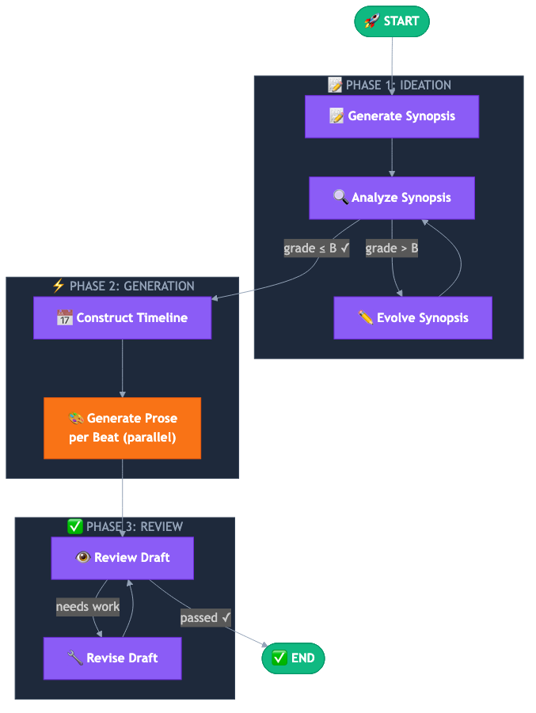

# Novel Generator - YAMLGraph Success Story


## The Hook

Ever fancied writing a novel? Now you can. One command:

```bash
yamlgraph graph run novel_generator.yaml \
  --var premise="A baker discovers she can taste emotions" \
  --var genre="magical realism"
```

80 lines of YAML. ~90 seconds. 1,100 words of polished prose.

---

## The Key Insight: YAML is AI-Friendly

Here's what I discovered building this with AI assistants: **declarative YAML is the perfect format for human-AI collaboration.**

Why?

1. **AI assistants can read it.** No hidden state, no implicit flows. The entire pipeline is visible in 80 lines.

2. **AI assistants can modify it.** Adding a node? One YAML block. Changing routing? One condition string. No hunting through class hierarchies.

3. **AI assistants can generate it.** Given examples and schema, AI can scaffold new pipelines from scratch.

4. **Humans can review it.** When AI suggests a change, you can actually *see* what's changing. No black-box commits.

This demo isn't just a novel generator. It's a taste of the future—where AI assistants and humans collaborate on *readable* artifacts, not tangled code.

---

## The Porting Story

I had a working novel generator—built with AI assistants over several iterations. Over 4,000 lines of Python spread across dozens of modules. Orchestration logic, quality loops, parallel generation, review gates. It worked. But every change required deep context, and AI assistants struggled to navigate the abstractions.

Then I asked: what if I rebuilt it in YAMLGraph?

**Result: 80 lines of YAML + 7 prompt files.**

The same three-phase architecture. But now:
- AI assistant could understand the entire flow in one read
- Changes were surgical—modify one YAML block
- Review was instant—diff shows exactly what changed

---

## The Three Phases

### Phase 1: Evolution Loop
Synopsis iterates until quality grade A or B:

```yaml
- from: analyze_synopsis
  to: evolve_synopsis
  condition: "analysis.grade > 'B'"
```

### Phase 2: Map Node
Parallel prose generation for each beat:

```yaml
generate_prose:
  type: map
  over: "{state.timeline.beats}"
  collect: prose_sections
```

### Phase 3: Quality Gate
Review → pass or revise loop:

```yaml
- from: review_draft
  to: END
  condition: "review.passed == true"
```

---

## Pipeline Diagram



```
📝 IDEATION    → generate → analyze → evolve ↺ → pass
⚡ GENERATION  → timeline → map(beats) → prose[]
✅ REVIEW      → review → revise ↺ → END
```

---

## What is YAMLGraph?

A YAML-first framework for LLM pipelines. Built on LangGraph.

**Core premise:** When your orchestration is declarative YAML, both humans and AI assistants can collaborate on it effectively.

**Features:** Multi-provider LLMs, parallel map nodes, conditional routing, quality gates, human-in-loop interrupts, streaming, checkpointing, LangSmith observability.

**GitHub:** [github.com/sheikkinen/yamlgraph](https://github.com/sheikkinen/yamlgraph)

---

## Try It

```bash
pip install yamlgraph
export ANTHROPIC_API_KEY=your-key

yamlgraph graph run examples/demos/novel_generator/graph.yaml \
  --var premise="A lighthouse keeper's parents disappeared with a ghost ship" \
  --var genre="dark fantasy"
```

---

## Sample Output

**Premise:** "A baker discovers she can taste emotions" | **Genre:** magical realism | **3 beats**

> Maya's fingers pressed into the butter, folding it between layers of dough for the third time. The kitchen was still dark—4:47 AM—and the only sound was the whisper of her rolling pin against the marble counter.
>
> But this morning tasted different.
>
> It started as she brought the dough to her nose, checking for the yeasty sweetness that meant the first rise was complete. Instead of smelling it, she felt it—a sharp, metallic tang coating her tongue. *Grief.* Not her grief. Someone else's, ancient and heavy, pressing down like fog on the harbor outside...

*~1,100 words generated in ~90 seconds. Full story in [README.md](README.md#sample-output).*

---

## References

- **LangGraph** - [langchain-ai/langgraph](https://github.com/langchain-ai/langgraph) - The graph orchestration engine underneath
- **Pydantic** - [pydantic.dev](https://pydantic.dev) - Structured LLM outputs
- **LangSmith** - [smith.langchain.com](https://smith.langchain.com) - Observability and tracing

---

## What to Explore Next

**[Beautify](../../beautify/)** - Meta-pipeline that transforms any YAMLGraph into a beautiful HTML infographic with Mermaid diagrams. Yes, the diagram in this article was generated by a YAMLGraph pipeline analyzing another YAMLGraph pipeline.

```bash
python -m examples.beautify.run examples/demos/novel_generator/graph.yaml --open
```

**[Innovation Matrix](../innovation_matrix/)** - Creativity method that crosses Capabilities × Constraints to generate ideas. Demonstrates nested map nodes and structured ideation.

**[Storyboard](../../storyboard/)** - Visual story generator combining LLM + Replicate image models. From concept to 3-5 panel illustrated story.

**[Web Research](../web-research/)** - Agent with web search tools. Shows tool integration and multi-step reasoning.

---

## Assets

| File | Purpose |
|------|---------|
| `cover.png` | Hero image for article/social |
| `diagram.png` | Pipeline diagram |
| `diagram.mmd` | Mermaid source (editable) |
| `showcase.html` | Full HTML showcase page |
