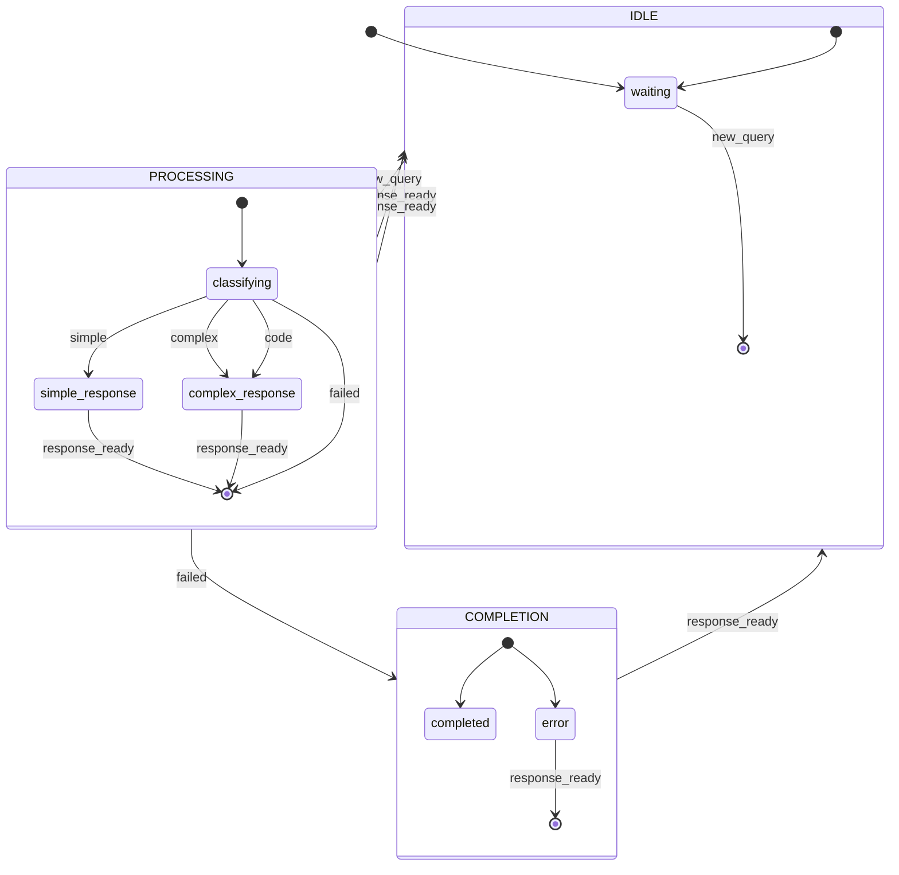
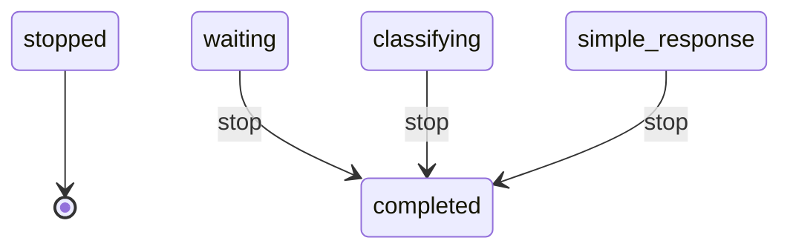

# State Machine

**Description:** 

**Generated from:** `router.yaml`
**Machine Name:** `query_router`
**Version:** `1.0.0`
**Job Type:** `unknown`

---

## Main State Machine Flow

---

## Stop/Shutdown Flow

---

## States Overview

| State | Description | Key Actions |
|-------|-------------|-------------|
| `waiting` | Waiting | N/A |
| `classifying` | Classifying | log, yamlgraph |
| `simple_response` | Simple Response | log, yamlgraph |
| `complex_response` | Complex Response | log, yamlgraph |
| `completed` | Completed | log |
| `error` | Error | log, log |

---

## Events Overview

| Event | Type | Description |
|-------|------|-------------|
| `new_query` | Internal | New Query |
| `simple` | Internal | Simple |
| `complex` | Internal | Complex |
| `code` | Internal | Code |
| `response_ready` | Internal | Response Ready |
| `failed` | Internal | Failed |

---

## Configuration Summary

- **States:** 6
- **Events:** 6
- **Transitions:** 9
- **Initial State:** `waiting`

---

*Generated by yaml_to_fsm.py*