# OCR Cleanup Pipeline

An example YAMLGraph pipeline that cleans up OCR text from scanned PDF documents using LLM-based processing.

## Overview

This pipeline:
1. **Extracts text** from PDF pages using `pdftotext` (preserving layout)
2. **Cleans each page** in parallel using an LLM to fix OCR artifacts
3. **Merges paragraphs** that span page boundaries
4. **Aggregates corrections** and generates statistics

## Prerequisites

- `pdftotext` (poppler-utils): `brew install poppler` (macOS) or `apt install poppler-utils` (Linux)
- YAMLGraph with LLM provider configured (default: Mistral)

## Usage

```bash
# Process full PDF
yamlgraph graph run examples/ocr_cleanup/graph.yaml \
  -v 'pdf_path=path/to/document.pdf'

# Process specific page range
yamlgraph graph run examples/ocr_cleanup/graph.yaml \
  -v 'pdf_path=path/to/document.pdf' \
  -v 'start_page=1' \
  -v 'end_page=10'
```

## Output

The pipeline produces structured output with:

- **paragraphs**: List of cleaned paragraphs with page references
- **corrections**: All OCR fixes applied (original → corrected)
- **chapters**: Detected chapter boundaries
- **stats**: Processing statistics

Example corrections:
```
ur- hoolliset → urhoolliset  (hyphenated word join)
varas- tosta → varastosta    (line-break hyphenation)
tahi → tai                   (archaic spelling normalized)
```

## Pipeline Structure

```mermaid
flowchart LR
    PDF["📄 PDF"] --> E["extract_text<br/>(pdftotext)"]
    E --> C["cleanup_pages<br/>(MAP)"]
    C --> M["merge_paragraphs"]
    M --> R["📝 Result"]

    C --> |parallel| L1["LLM page 1"]
    C --> |parallel| L2["LLM page 2"]
    C --> |parallel| LN["LLM page N"]
```



### Nodes

| Node | Type | Description |
|------|------|-------------|
| `extract_text` | python | Extracts text from PDF pages |
| `cleanup_pages` | map | Parallel LLM cleanup of each page |
| `merge_paragraphs` | python | Joins paragraphs and aggregates results |

## Files

```
examples/ocr_cleanup/
├── graph.yaml                 # Pipeline definition
├── prompts/
│   └── cleanup_page.yaml      # LLM prompt for page cleanup
├── tools/
│   ├── pdf_extract.py         # PDF text extraction
│   └── merger.py              # Paragraph merging
└── tests/
    ├── test_pdf_extract.py
    ├── test_cleanup_prompt.py
    └── test_merger.py
```

## OCR Fixes Applied

The LLM identifies and fixes common OCR artifacts:

- **Hyphenated line breaks**: `ur-` + `hoolliset` → `urhoolliset`
- **Character misreads**: `■asunsa` → `asunsa`
- **Spacing issues**: `.    ..` → `...`
- **Paragraph boundaries**: Detects text continuing to next page

## Running Tests

```bash
python -m pytest examples/ocr_cleanup/tests/ -v
```

## Customization

### Different LLM Provider

Set `LLM_PROVIDER` environment variable or modify `graph.yaml`:

```yaml
metadata:
  llm:
    provider: anthropic
    model: claude-3-haiku-20240307
```

### Language

Edit `prompts/cleanup_page.yaml` to adjust for different languages (default: Finnish).

## Batch Processing (Full Books)

For processing entire books or large PDFs, use the batch runner which processes pages in configurable batches with resume support:

```bash
# Process full PDF (default: 10 pages per batch)
python -m examples.ocr_cleanup.run path/to/book.pdf

# Custom batch size
python -m examples.ocr_cleanup.run path/to/book.pdf --workers 20

# Process specific page range
python -m examples.ocr_cleanup.run path/to/book.pdf --start 50 --end 100

# Use synchronous mode (for providers that don't support async parallel)
python -m examples.ocr_cleanup.run path/to/book.pdf --sync
```

### Batch Runner Features

- **Resume support**: Automatically skips completed batches
- **Page-specific outputs**: Each batch saves to `batch_NNN.json`
- **Cross-batch merging**: Paragraphs spanning batch boundaries are joined
- **Final consolidation**: Produces `final.json` and `final.txt`

### Output Location

```
outputs/ocr_cleanup/{pdf_name}/
├── batch_000.json    # First batch results
├── batch_001.json    # Second batch results
├── ...
├── final.json        # Consolidated structured data
└── final.txt         # Clean text for reading
```

### Performance Tips

- Use `--workers 10-20` for Anthropic (true parallel execution)
- Use smaller batches (`--workers 5`) for Mistral/xAI (sequential execution)
- The `--async` flag (default) enables parallel LLM calls within batches

## Complete Workflow

### Phase 1: Automated Processing

```bash
python -m examples.ocr_cleanup.run path/to/book.pdf --workers 10
```

Produces `final.json` and `final.txt` in the output directory.

### Phase 2: Manual Review

Open `final.txt` in VS Code and use **Find & Replace** (Cmd+H) with regex enabled:

#### Find broken paragraphs (line breaks mid-sentence)

```regex
(?<=\S[^.!?…])\n
```

Matches linebreaks after non-punctuation. Replace with space to join broken paragraphs.

#### Find non-printable/garbage characters

```regex
[^\p{L}\p{P}\s\d]
```

Matches anything that's not a letter, punctuation, whitespace, or digit. Review and remove artifacts.

#### Find garbage characters (Finnish-specific)

```regex
[^a-zA-ZäöåüÄÖÅÜ.,;:!?'"()\-\s…]
```

Matches anything that's not a Finnish letter, common punctuation, or whitespace. More precise for Finnish text.

#### Preprocessing: Normalize quotes

Before manual review, run these regex replacements:

| Find | Replace | Description |
|------|---------|-------------|
| `»` | `"` | Guillemet to quote |
| `«` | `"` | Guillemet to quote |
| `„` | `"` | Low-9 quote to quote |
| `"` | `"` | Curly quote to straight |
| `"` | `"` | Curly quote to straight |
| `'` | `'` | Curly apostrophe to straight |
| `'` | `'` | Curly apostrophe to straight |

Or run all at once with regex:

```regex
[»«„""]   →   "
[''']     →   '
```

#### Find unusual Unicode

```regex
[\x00-\x08\x0B\x0C\x0E-\x1F\x7F]
```

Matches control characters that shouldn't be in text.

### Phase 3: Merge Corrected Text

After manual editing, merge your corrected `final.txt` back with page information:

```bash
python -m examples.ocr_cleanup.tools.merge_corrected \
  outputs/ocr_cleanup/{book}/final.json \
  outputs/ocr_cleanup/{book}/final.txt
```

Produces `final_pages.json` with:
- Corrected text from your edited `final.txt`
- Page attribution preserved from original `final.json`
- Fuzzy matching handles merged/split paragraphs

### Output Files Summary

| File | Description |
|------|-------------|
| `batch_NNN.json` | Per-batch LLM results |
| `final.json` | Consolidated structured data (pre-manual edit) |
| `final.txt` | Plain text for manual editing |
| `final_pages.json` | Final output with corrected text + page info |
