# Feature Request: Enhanced Mermaid Diagram Generation

**Priority:** MEDIUM
**Type:** Enhancement
**Status:** Proposed
**Effort:** 2-3 days
**Requested:** 2026-01-29

## Summary

Enhance the `yamlgraph graph mermaid` command with professional styling, subgraph visualization, loop indicators, and configurable themes.

## Problem

Current mermaid generation is basic:
- No node styling (colors, borders)
- No subgraph grouping for nested graphs
- No visual distinction for loop/self-edges
- No theme support for dark/light modes
- No emoji/icon support for node types

When creating production documentation (e.g., architecture infographics), manual styling is required.

## Current Output


## Proposed Solution

### 1. Node Type Styling

Add `--theme` flag with predefined color schemes:

```bash
yamlgraph graph mermaid graph.yaml --theme dark
yamlgraph graph mermaid graph.yaml --theme light
yamlgraph graph mermaid graph.yaml --theme minimal
```

**Dark Theme Color Map:**

| Type | Fill | Stroke | Description |
|------|------|--------|-------------|
| router | #db2777 | #ec4899 | Pink - decision points |
| interrupt | #d97706 | #f59e0b | Amber - user interaction |
| llm | #8b5cf6 | #a78bfa | Purple - LLM calls |
| tool | #059669 | #10b981 | Emerald - Python functions |
| subgraph | #0891b2 | #06b6d4 | Cyan - nested graphs |
| passthrough | #4b5563 | #6b7280 | Gray - state pass-through |
| agent | #1e3a8a | #3b82f6 | Blue - agent nodes |

**Output with styling:**


### 2. Subgraph Grouping

Detect `subgraph` node types and render as Mermaid subgraphs:

**Input (graph.yaml):**

```yaml
nodes:
  classify:
    type: router
  run_interrai:
    type: subgraph
    graph: interrai-ca/graph.yaml
  run_phq9:
    type: subgraph
    graph: phq9/graph.yaml
```

**Output:**



```mermaid
flowchart TB
    subgraph NAV[" 🧭 Navigator "]
        classify{{"🔀 classify"}}
    end

    classify -->|elderlycare| run_interrai
    classify -->|depression| run_phq9

    run_interrai["📦 interRAI-CA"]
    run_phq9["📦 PHQ-9"]

    style NAV fill:#1e3a8a,stroke:#3b82f6,stroke-width:2px
```

### 3. Loop Indicators

Detect self-edges (node → same node) and render with loop notation:

**Input:**

```yaml
edges:
  - from: ask_probe
    to: ask_probe
    condition: has_gaps
  - from: ask_probe
    to: recap
    condition: complete
```

**Output:**



```mermaid
flowchart LR
    ask_probe[/"⏸️ ask_probe"/]
    ask_probe -->|has_gaps| ask_probe
    ask_probe -->|complete| recap
```

### 4. Phase Grouping

Add `--group-phases` flag to auto-detect phases from naming patterns or explicit `phase` metadata:

**Input:**

```yaml
nodes:
  ask_opening:
    type: interrupt
    phase: init
  ask_probe:
    type: interrupt
    phase: probe
  ask_recap:
    type: interrupt
    phase: recap
  calculate_score:
    type: tool
    phase: final
```

**Output:**



```mermaid
flowchart LR
    subgraph INIT[" 🚀 INIT "]
        ask_opening[/"⏸️ ask_opening"/]
    end

    subgraph PROBE[" 🔄 PROBING "]
        ask_probe[/"⏸️ ask_probe"/]
        ask_probe -->|has_gaps| ask_probe
    end

    subgraph RECAP[" ✅ RECAP "]
        ask_recap[/"⏸️ ask_recap"/]
    end

    subgraph FINAL[" 🏁 SCORE "]
        calculate_score["🐍 calculate_score"]
    end

    style INIT fill:#1e293b,stroke:#334155
    style PROBE fill:#1e3a5f,stroke:#3b82f6
    style RECAP fill:#3b1f4a,stroke:#8b5cf6
    style FINAL fill:#14532d,stroke:#22c55e
```

### 5. Direction Control

Add `--direction` flag:

```bash
yamlgraph graph mermaid graph.yaml --direction TD  # Top-Down (default)
yamlgraph graph mermaid graph.yaml --direction LR  # Left-Right
yamlgraph graph mermaid graph.yaml --direction BT  # Bottom-Top
yamlgraph graph mermaid graph.yaml --direction RL  # Right-Left
```

### 6. Emoji Icons

Add `--icons` flag to prefix nodes with type emojis:

| Type | Emoji | Description |
|------|-------|-------------|
| router | 🔀 | Decision point |
| interrupt | ⏸️ | User interaction |
| llm | 🧠 | LLM call |
| tool | 🐍 | Python function |
| subgraph | 📦 | Nested graph |
| passthrough | ➡️ | State passthrough |
| agent | 🤖 | Agent node |

### 7. Node Shape Mapping (Enhanced)

Update shapes to match Mermaid best practices:

| Type | Shape | Mermaid Syntax |
|------|-------|----------------|
| router | Hexagon | `{{"node"}}` |
| interrupt | Parallelogram | `[/"node"/]` |
| llm | Rectangle | `["node"]` |
| tool | Rectangle | `["node"]` |
| subgraph | Rectangle + icon | `["📦 node"]` |
| passthrough | Stadium | `(["node"])` |
| agent | Circle | `(("node"))` |

### 8. HTML Export with Mermaid.js

Add `--format html` for standalone HTML with embedded Mermaid:

```bash
yamlgraph graph mermaid graph.yaml --format html -o diagram.html
```

**Output:**

```html
<!DOCTYPE html>
<html>
<head>
    <script src="https://cdn.jsdelivr.net/npm/mermaid@10/dist/mermaid.min.js"></script>
    <script>
        mermaid.initialize({
            startOnLoad: true,
            theme: 'dark',
            themeVariables: {
                primaryColor: '#3b82f6',
                background: '#0f172a',
                mainBkg: '#1e293b',
                nodeBorder: '#475569',
                clusterBkg: '#1e293b',
                clusterBorder: '#334155'
            }
        });
    </script>
</head>
<body style="background: #0f172a;">
    <pre class="mermaid">
    <!-- Generated diagram here -->
    </pre>
</body>
</html>
```

## CLI Interface

```bash
# Basic usage (unchanged)
yamlgraph graph mermaid graph.yaml

# With styling
yamlgraph graph mermaid graph.yaml --theme dark --icons

# With subgraph expansion
yamlgraph graph mermaid graph.yaml --expand-subgraphs

# With phase grouping
yamlgraph graph mermaid graph.yaml --group-phases

# Full featured
yamlgraph graph mermaid graph.yaml \
    --theme dark \
    --icons \
    --direction LR \
    --group-phases \
    --format html \
    -o architecture.html
```

## Implementation

### Updated `generate_mermaid` signature:

```python
def generate_mermaid(
    config: dict,
    *,
    theme: Literal["dark", "light", "minimal"] = "minimal",
    icons: bool = False,
    direction: Literal["TD", "LR", "BT", "RL"] = "TD",
    group_phases: bool = False,
    expand_subgraphs: bool = False,
) -> str:
```

### New files:

```
yamlgraph/cli/
├── graph_mermaid.py        # Updated
├── mermaid_themes.py       # Theme definitions
└── mermaid_templates.py    # HTML template
```

## Acceptance Criteria

- [ ] `--theme dark|light|minimal` applies node colors
- [ ] `--icons` prefixes nodes with type emojis
- [ ] `--direction TD|LR|BT|RL` controls flow direction
- [ ] `--group-phases` groups nodes by `phase` metadata
- [ ] Self-edges render correctly as loops
- [ ] `--format html` outputs standalone HTML
- [ ] Subgraph nodes styled with 📦 icon
- [ ] Existing behavior preserved when no flags
- [ ] Tests for each feature flag
- [ ] README updated with examples

## Alternatives Considered

1. **D3.js visualization**: More flexible but requires JavaScript. Mermaid is simpler and widely supported.
2. **Graphviz/DOT**: Powerful but less web-friendly. Mermaid renders in GitHub/GitLab READMEs.
3. **Custom SVG**: Maximum control but high effort. Mermaid abstracts layout.

## Related

- Current implementation: `yamlgraph/cli/graph_mermaid.py`
- Reference infographic: `questionnaire-api/src/api/static/graph-architecture-infographic.html`
- Mermaid docs: https://mermaid.js.org/syntax/flowchart.html
